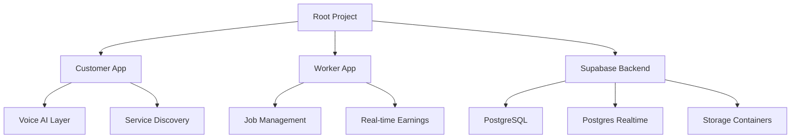

# NEARA - Hyperlocal Service Discovery Platform

[](https://flutter.dev)
[](https://supabase.com)
[](https://deepmind.google/technologies/gemini/)

NEARA is a revolutionary, voice-first hyperlocal service platform that connects customers with skilled workers instantly. By leveraging AI-powered intent recognition and real-time location tracking, NEARA simplifies how services are requested and fulfilled in the modern neighborhood.

---

## 🏗️ Project Architecture

This repository follows a **Clean Architecture** approach with **Feature-based** organization.



### Core Sub-Projects:
- **[Customer App](./customer_app/)**: User-facing Flutter app for discovering and booking services.
- **[Worker App](./worker_app/)**: Partner-facing Flutter app for accepting and managing service requests.
- **[Database Schema](./supabase_schema.sql)**: Complete SQL definitions for Supabase tables, RLS policies, and functions.

---

## 🎯 Key Features

### 🎙️ Voice-First Intent Recognition
- Uses **Gemini 2.5 Flash** for high-accuracy intent detection.
- Natural language processing for multi-lingual service requests (English, Hindi).
- Seamlessly converts "My tap is leaking" into a Plumbing service request.

### 📍 Hyperlocal Matching & GPS
- Real-time GPS coordinate tracking for both Customers and Workers.
- Distance-based worker discovery to ensure the fastest response times.
- Integrated Google Maps navigation for workers to reach customer locations.

### 🛡️ Secure payment Escrow
- **Milestone-based Payments**: Supports advance and final payments.
- **Automatic Ledger**: Real-time earnings tracking for workers with live transaction updates.
- **Secure Transaction Storage**: Leverages Supabase for immutable payment history.

### 🚨 Emergency SOS Mode
- Dedicated high-priority matching for urgent services (Roadside Assistance, Medical, etc.).
- Instant notifications to emergency contacts.

---

## 🚀 Tech Stack

| Component | Technology |
| :--- | :--- |
| **Frontend** | Flutter 3.16+ (Dart 3.2+) |
| **Backend** | Supabase (PostgreSQL + Auth + Realtime) |
| **AI Engine** | Google Gemini 2.5 Flash |
| **State Mgt** | Riverpod 2.4+ |
| **Navigation** | GoRouter / Navigator 2.0 |
| **Media Storage** | Supabase Storage (Job Photos & Profiles) |
| **Map APIs** | Google Maps SDK + `url_launcher` |

---

## 💻 Getting Started

### Prerequisites
- [Flutter SDK](https://docs.flutter.dev/get-started/install) (Stable Channel)
- [Supabase CLI](https://supabase.com/docs/guides/cli)
- Google Cloud API Key (for Gemini and Maps)

### Setup & Installation

1.  **Clone the Repository**
    ```bash
    git clone [repository-url]
    cd Neara-AI
    ```

2.  **Initialize Supabase**
    - Create a new project on [Supabase.com](https://supabase.com).
    - Run the commands in `supabase_schema.sql` in the SQL Editor.
    - Set up `.env` files in both `customer_app` and `worker_app` with your `SUPABASE_URL` and `SUPABASE_ANON_KEY`.

3.  **Run the Apps**

    #### Customer App
    ```bash
    cd customer_app
    flutter pub get
    flutter run
    ```

    #### Worker App
    ```bash
    cd worker_app
    flutter pub get
    flutter run
    ```

---

## 🛡️ Security & Privacy
- **RLS (Row Level Security)**: Data is protected at the database layer; workers only see pertinent job data.
- **Privacy First**: Customer's exact location is only shared once a worker confirms arrival or payment is initiated.
- **Media Access**: Secure tokens for viewing job-related documentation photos.

---

## 📊 Roadmap
- [x] Phase 1-5: Core MVP (Voice AI, Payments, Real-time tracking)
- [x] Phase 6: Real-time Earnings Ledger & Polish
- [ ] Phase 7: Automated Dispute Resolution
- [ ] Phase 8: Multi-region Scaling

---

## 📄 License
© 2026 Neara-AI. All Rights Reserved.
