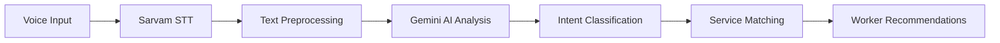
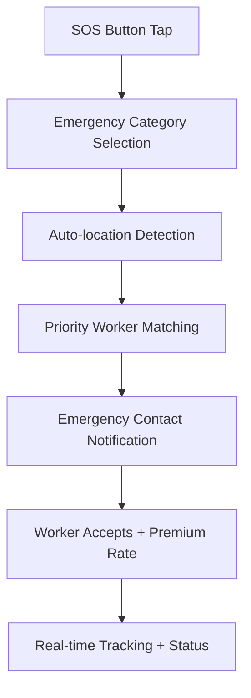

# NEARA Customer App
## Voice-First Emergency Service Discovery Platform

**Target Users:** Urban consumers needing immediate skilled services  
**Core Mission:** Transform service discovery from hours to seconds through AI-powered voice interaction

---

## 🎆 App Overview

The NEARA Customer App revolutionizes how Indians access hyperlocal services by replacing complex forms and searches with **natural voice commands**. Simply speak your problem in Hindi or English, and our AI instantly connects you with verified nearby workers.

### 🎡 **Key Value Propositions**
- **⚡ 10-second service discovery** via AI voice processing
- **📍 Hyperlocal worker matching** within 5-15km radius  
- **🛡️ Escrow payment protection** with milestone-based releases
- **🎆 Emergency SOS mode** for critical situations
- **🗣️ Multilingual support** (Hindi/English with auto-detection)

---

## 🏗️ Technical Architecture

### **Voice Processing Pipeline**


### **State Management Flow**
- **Riverpod Providers** for reactive state across voice, search, and booking flows
- **Real-time WebSocket** sync with Supabase for live worker status
- **GoRouter** for type-safe navigation with deep-linking support

### **Core Services Architecture**
```
services/
├── stt_service.dart           # Sarvam AI speech-to-text
├── ai_intent_service.dart     # Gemini LLM analysis  
├── worker_repository.dart     # Supabase worker operations
├── location_service.dart      # GPS + Google Maps integration
├── payment_service.dart       # Razorpay escrow handling
└── notification_service.dart  # FCM push notifications
```

---

## 🚀 Core Features & Implementation

### 🎙️ **1. AI Voice Interface**
**File:** `lib/viewmodels/intent_viewmodel.dart`

**Capabilities:**
- **4-layer voice validation:** Amplitude detection, silence handling, transcript cleaning, gibberish filtering
- **Intent extraction:** Service category, urgency level, location context  
- **Confidence scoring:** High-confidence requests (>0.9) auto-proceed, low confidence requests clarification dialog

**Voice Processing Features:**
```dart
// Text normalization removes filler words, extra spaces
"um... uh... mera car won't start" → "mera car won't start"

// Gibberish detection catches meaningless input
"hehehehe lalala" → Rejected with clarification prompt

// Multi-language intent analysis  
"bijli ka fan nahi chal raha" → {service: "electrician", urgency: "medium"}
"AC not cooling properly" → {service: "electrician", urgency: "high"}
```

### 🗺️ **2. Hyperlocal Worker Discovery**
**File:** `lib/screens/worker_selection_screen.dart`

**Smart Matching Algorithm:**
- **Proximity ranking:** Workers sorted by distance (5km > 10km > 15km)
- **Availability filtering:** Real-time status updates via Supabase subscriptions
- **Rating & review integration:** Verified customer feedback with photo proof
- **Category specialization:** Plumber ≠ Electrician, precise skill matching

**Map Integration:**
```dart
// Real-time worker location updates
Stream<List<WorkerLocation>> watchNearbyWorkers({
  required ServiceCategory category,
  required LatLng userLocation,
  double radiusKm = 10,
});
```

### 💳 **3. Secure Escrow Payment System**
**File:** `lib/services/payment_service.dart`

**Two-Phase Payment Flow:**
1. **Advance Payment (20-30%):** Secures worker booking, held in escrow
2. **Final Payment (70-80%):** Released when customer approves work completion

**Payment Security Features:**
- **Razorpay integration** with UPI, cards, net banking
- **Automatic refunds** for cancelled or no-show bookings
- **Dispute resolution** with photo evidence and admin review
- **Real-time payment tracking** via Supabase triggers

### 🎆 **4. Emergency SOS Mode**
**File:** `lib/screens/emergency_screen.dart`

**Critical Situation Handling:**
- **One-tap emergency activation** bypasses normal booking flow
- **Priority worker matching** with 2x rate compensation
- **Auto-notification** to emergency contacts with location sharing
- **Category-specific urgency:** Gas leak = CRITICAL, Car breakdown = HIGH

**Emergency Categories:**
```dart
enum EmergencyType {
  gasLeak,           // CRITICAL - Immediate safety risk
  electricalHazard,  // CRITICAL - Fire/shock risk  
  waterBurst,        // HIGH - Property damage risk
  roadsideAssistance,// HIGH - Safety + mobility
  generalRepair      // MEDIUM - Standard service
}
```

### 📱 **5. Real-time Service Tracking** 
**File:** `lib/screens/service_tracking_screen.dart`

**Live Status Updates:**
- **Worker location tracking** with ETA calculations
- **Status progression:** Accepted → En Route → Arrived → Working → Completed
- **Photo documentation:** Before/after images for work verification
- **Direct communication:** In-app calling and messaging

---

## 📋 User Journey Flow

### **Standard Service Request**
```mermaid
graph TD
    A[Voice: "Mera AC theek karna hai"] --> B[AI Analysis: Electrician + Medium Urgency]
    B --> C[Show 5 Nearby Workers]
    C --> D[Select Worker + View Profile]
    D --> E[Pay Advance via UPI]
    E --> F[Worker Notified + Accepts]
    F --> G[Track Worker Location]
    G --> H[Service Completion + Photo Review]
    H --> I[Approve Work + Release Balance]
```

### **Emergency SOS Flow**


---

## 📝 Key Screens & Navigation

| Screen | Purpose | Key Features |
|--------|---------|-------------|
| `SplashScreen` | App initialization | Location permission, auth check |
| `VoiceHeroCard` | Main voice interface | AI-powered service discovery |
| `WorkerSelectionScreen` | Worker browsing | Map view, filters, profiles |
| `ServiceSummaryScreen` | Booking confirmation | Service details, pricing |
| `PaymentScreen` | Escrow payment | UPI/card payment, advance handling |
| `ServiceTrackingScreen` | Live job tracking | Worker location, status updates |
| `EmergencyScreen` | SOS functionality | Priority matching, emergency contacts |
| `MyBookingsScreen` | Booking history | Past services, ratings, receipts |

---

## 🎯 Performance & Optimization

### **Voice Processing Optimization**
- **8-10 second response time** from voice input to worker recommendations
- **Amplitude-based silence detection** prevents empty recordings
- **Local caching** of frequent service patterns for faster intent recognition

### **Real-time Performance**
- **Supabase WebSocket subscriptions** for live worker status updates
- **Optimistic UI updates** for immediate user feedback
- **Background location sync** maintains accurate user coordinates

### **Accessibility & Localization**
- **Voice-first design** with large touch targets (min 44dp)
- **High contrast colors** for emergency visibility
- **Hindi/English mixed input** support with auto-language detection
- **Offline mode** for essential features during poor connectivity

---

## 🔧 Development Setup

### **Prerequisites**
- Flutter 3.16+
- Dart 3.0+
- Android Studio / VS Code
- Physical device (for voice testing)

### **Environment Configuration**
Create `.env` file in project root:
```bash
# Supabase Backend
SUPABASE_URL=your_supabase_project_url
SUPABASE_ANON_KEY=your_supabase_anon_key

# AI Services
OPENROUTER_API_KEY=your_openrouter_api_key
SARVAM_API_KEY=your_sarvam_stt_key

# Google Services  
GOOGLE_MAPS_API_KEY=your_google_maps_key

# Payment Gateway
RAZORPAY_KEY_ID=your_razorpay_key
```

### **Installation & Run**
```bash
# Install dependencies
flutter pub get

# Generate environment configs
flutter packages pub run build_runner build

# Run on device (voice features require physical device)
flutter run --flavor dev
```

---

## 📊 Success Metrics

**Voice Interface Performance**
- Intent accuracy: >90% for clear voice input
- Response time: <10 seconds voice-to-recommendations
- User retry rate: <15% for voice commands

**Service Discovery Efficiency** 
- Time to worker selection: <2 minutes average
- Worker acceptance rate: >80% within 10 minutes
- Customer satisfaction: >4.5/5 rating average

**Business Impact**
- Service completion rate: >95% once worker accepted
- Payment success rate: >99% via escrow system
- Emergency response time: <10 minutes average

---

## ⚙️ Configuration

1.  **Environment Variables**
    Create a `.env` file in the `customer_app` root:
    ```env
    SUPABASE_URL=your_supabase_url
    SUPABASE_ANON_KEY=your_supabase_key
    GEMINI_API_KEY=your_google_ai_key
    ```

2.  **Dependencies**
    ```bash
    flutter pub get
    ```

3.  **Run Development**
    ```bash
    flutter run
    ```

---

## 🤝 Support
For any issues regarding the customer app, please refer to the main repository documentation.
