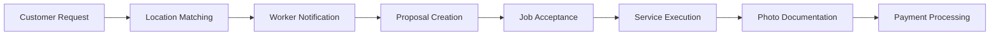
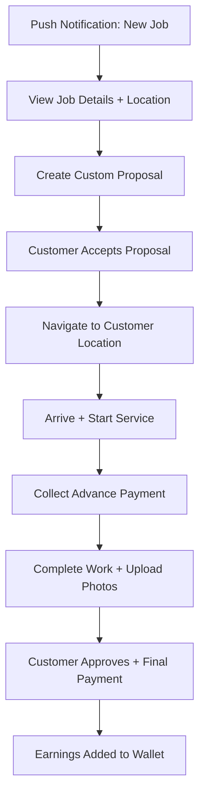

# NEARA Worker App
## Professional Service Management Platform for Skilled Technicians

**Target Users:** Skilled service professionals (plumbers, electricians, mechanics)  
**Core Mission:** Maximize worker earnings through low-commission digital platform with real-time job management

---

## 🏗️ App Overview 

The NEARA Worker App transforms how skilled technicians manage their service business by providing **real-time job notifications**, **transparent pricing control**, and **instant earnings tracking**. Workers keep 95-97% of customer payments (only 3-5% platform fee vs 20-30% industry standard).

### 🎡 **Key Value Propositions**
- **💰 95-97% earnings retention** (3-5% platform fee only)
- **⚡ Real-time job notifications** within 5-15km radius
- **📍 GPS-optimized routing** to customer locations
- **🖼️ Professional portfolio** with ratings and work gallery
- **📊 Live earnings dashboard** with instant payment tracking

---

## 🏗️ Technical Architecture

### **Real-time Job Pipeline**


### **Feature-Based Architecture**
```
lib/
├── features/
│   ├── auth/
│   │   ├── screens/         # Login, registration, profile setup
│   │   └── providers/       # Auth state management
│   ├── dashboard/
│   │   ├── screens/         # Main stats, active jobs overview
│   │   └── services/        # Dashboard data aggregation  
│   ├── requests/
│   │   ├── screens/         # Job filtering, request details
│   │   └── providers/       # Request state management
│   ├── proposals/
│   │   ├── screens/         # Proposal creation, sent proposals
│   │   └── models/          # Proposal data structures
│   ├── jobs/
│   │   ├── screens/         # Job execution, photo upload
│   │   └── providers/       # Job state management
│   └── earnings/
│       ├── screens/         # Earnings ledger, transaction history
│       └── services/        # Payment processing integration
├── services/
│   ├── supabase_service.dart    # Database operations
│   ├── notification_service.dart # FCM push notifications
│   └── location_service.dart    # GPS tracking
└── core/
    ├── theme/          # App styling and design tokens
    └── models/         # Shared data models
```

---

## 🚀 Core Features & Implementation

### 📱 **1. Smart Request Management**
**File:** `lib/features/requests/screens/requests_hub_screen.dart`

**Real-time Job Discovery:**
- **Location-based filtering:** Receive notifications for jobs within worker's preferred radius (5-15km)
- **Category specialization:** Plumber sees only plumbing jobs, electrician sees electrical work
- **Urgency prioritization:** Emergency jobs (gas leaks, electrical hazards) appear at top with premium rates
- **Auto-refresh:** Supabase real-time subscriptions update job list every 2-3 seconds

**Smart Filtering Options:**
```dart
class RequestFilter {
  final ServiceCategory? category;     // Filter by specialization
  final EmergencyUrgency? urgency;     // Emergency jobs only
  final double? maxDistance;           // Distance radius
  final DateTimeRange? timeRange;      // Preferred working hours
  final double? minPayment;           // Payment threshold
}
```

### 📝 **2. Dynamic Proposal System**
**File:** `lib/features/proposals/screens/create_proposal_screen.dart`

**Flexible Pricing Control:**
- **Inspection fee:** Worker sets diagnostic/assessment charge (₹100-500)
- **Service estimation:** Transparent labor + material cost breakdown
- **Emergency premium:** 1.5-2x rate multiplier for urgent requests
- **Payment terms:** Clear advance (20-30%) + completion (70-80%) split

**Proposal Features:**
```dart
class ServiceProposal {
  final double inspectionFee;         // Diagnostic charge
  final double estimatedCost;         // Total service cost
  final String workDescription;       // Detailed work scope
  final Duration estimatedDuration;   // Expected completion time  
  final List<String> materialsNeeded; // Required parts/supplies
  final bool emergencyPremium;        // Premium rate for urgent jobs
}
```

### 📹 **3. Professional Job Execution**
**File:** `lib/features/jobs/screens/job_in_progress_screen.dart`

**Structured Service Workflow:**
1. **Job Acceptance:** Worker confirms availability and heads to location
2. **Arrival Notification:** GPS-based auto-check-in when reaching customer
3. **Advance Payment:** Customer pays inspection + partial service fee via app
4. **Service Documentation:** Mandatory before/after photos for work verification
5. **Completion Approval:** Customer reviews work and releases final payment

**Photo Documentation System:**
```dart
class JobPhotos {
  final List<String> beforePhotos;    // Pre-service condition
  final List<String> duringPhotos;    // Work progress documentation 
  final List<String> afterPhotos;     // Completed work verification
  final String? issueDescription;     // Problem description
  final String? solutionSummary;      // Work performed summary
}
```

### 💰 **4. Real-time Earnings Tracking**
**File:** `lib/features/earnings/screens/earnings_dashboard_screen.dart`

**Live Payment Processing:**
- **Supabase triggers:** Automatic earnings updates when customer pays
- **Transaction categorization:** Advance payments vs final payments vs bonuses
- **Daily/weekly/monthly views:** Comprehensive earnings analytics
- **Withdrawal management:** Bank transfer integration with instant processing

**Earnings Analytics:**
```dart
class EarningsData {
  final double todayEarnings;         // Current day income
  final double weeklyAverage;         // 7-day rolling average
  final double monthlyTarget;         // Worker-set income goal
  final int completedJobs;           // Service count metrics
  final double averageJobValue;       // Revenue per service
  final double emergencyBonus;        // Premium payments earned
}
```

### 🗺️ **5. Integrated Navigation & Communication**
**File:** `lib/features/jobs/screens/customer_location_screen.dart`

**Seamless Customer Interaction:**
- **One-tap Google Maps navigation** to exact customer coordinates
- **In-app calling** without exposing personal phone numbers
- **Real-time location sharing** so customers can track worker arrival
- **ETA calculations** with traffic-aware routing via OSRM

**Location & Communication Features:**
```dart
class CustomerInteraction {
  final LatLng customerLocation;      // Precise GPS coordinates
  final String customerPhone;        // Masked phone for calling
  final String locationNotes;        // Building/landmark details
  final Duration estimatedArrival;   // Traffic-aware ETA
  final bool isEmergency;            // Priority routing flag
}
```

---

## 📋 Worker Journey Flow

### **Standard Service Request**


### **Emergency Priority Request**
```mermaid
graph TD
    A[URGENT: Emergency Notification] --> B[Accept with Premium Rate]
    B --> C[Priority Navigation]
    C --> D[Immediate Service Start]
    D --> E[Emergency Documentation]
    E --> F[Premium Payment (1.5-2x Rate)]
```

---

## 📈 Business Model & Worker Benefits

### **Revenue Maximization**
| Platform Fee Comparison | NEARA | Urban Company | Justdial | Direct Customer |
|-------------------------|--------|---------------|----------|------------------|
| **Platform Commission** | 3-5% | 20-30% | Lead fees | 0% |
| **Worker Retention** | 95-97% | 70-80% | Variable | 100% |
| **Digital Reach** | City-wide | Limited slots | Directory only | Word-of-mouth |
| **Payment Security** | Escrow protected | Platform managed | Cash-based | Trust-based |
| **Professional Growth** | Ratings + portfolio | Limited visibility | Contact only | Local reputation |

### **Professional Development Features**
- **Digital portfolio:** Showcase completed work with customer reviews
- **Skill verification:** Category-wise certification and rating system  
- **Business analytics:** Track peak hours, customer demographics, service trends
- **Referral network:** Earn bonuses for bringing other skilled workers to platform

---

## 📱 Key Screens & User Experience

| Screen | Purpose | Key Features |
|--------|---------|-------------|
| `LoginScreen` | Worker authentication | Mobile OTP, profile verification |
| `DashboardScreen` | Daily overview | Active jobs, today's earnings, notifications |
| `RequestsHubScreen` | Job browsing | Real-time job feed, filters, location view |
| `CreateProposalScreen` | Custom pricing | Service estimation, inspection fees |
| `JobInProgressScreen` | Service execution | Status updates, photo upload, customer contact |
| `EarningsDashboardScreen` | Income tracking | Live earnings, transaction history |
| `ProfileSetupScreen` | Professional profile | Skills, availability, service areas |
| `CustomerLocationScreen` | Navigation | GPS routing, arrival confirmation |

---

## 🚀 Performance & Optimization

### **Real-time Responsiveness**
- **Sub-3-second job notifications** via optimized FCM + Supabase triggers
- **Offline capability** for essential features during poor connectivity
- **Background location sync** maintains accurate worker coordinates
- **Lazy loading** for earnings history and large job lists

### **Professional Reliability** 
- **99.9% uptime** for job notifications and payment processing
- **Automatic retry logic** for failed photo uploads or payment confirmations
- **Data sync recovery** ensures no earnings or job data loss
- **Battery optimization** for all-day background location tracking

---

## 🔧 Development Setup

### **Prerequisites**
- Flutter 3.16+
- Dart 3.0+
- Android Studio / VS Code
- Physical device (for GPS testing)

### **Environment Configuration**
Create `.env` file in project root:
```bash
# Supabase Backend
SUPABASE_URL=your_supabase_project_url
SUPABASE_ANON_KEY=your_supabase_anon_key

# Google Services
GOOGLE_MAPS_API_KEY=your_google_maps_key

# Firebase Notifications
FCM_SERVER_KEY=your_fcm_server_key

# Payment Processing
RAZORPAY_KEY_ID=your_razorpay_key
```

### **Installation & Run**
```bash
# Install dependencies
flutter pub get

# Generate environment configs
flutter packages pub run build_runner build

# Run on device (location features require physical device)
flutter run --flavor dev --dart-define=ENVIRONMENT=development
```

### **Testing Configuration**
```bash
# Run unit tests
flutter test

# Run integration tests (requires test device)
flutter drive --target=test_driver/app.dart

# Test location services (requires GPS-enabled device)
flutter run --debug --enable-experiment=location-testing
```

---

## 📊 Success Metrics & KPIs

**Job Management Efficiency**
- Job acceptance rate: >70% within 15 minutes
- Service completion rate: >95% once job accepted  
- Customer satisfaction: >4.5/5 rating average
- Photo documentation compliance: >98%

**Earnings Performance**
- Average earnings increase: >40% vs traditional methods
- Payment processing time: <24 hours for completed jobs
- Dispute rate: <2% of total transactions
- Worker retention rate: >85% month-over-month

**Platform Reliability**
- Notification delivery: >99% success rate
- App uptime: >99.9% availability
- GPS accuracy: <10 meter location precision
- Real-time sync latency: <3 seconds
    ```env
    SUPABASE_URL=your_supabase_url
    SUPABASE_ANON_KEY=your_supabase_key
    ```

2.  **Dependencies**
    ```bash
    flutter pub get
    ```

3.  **Run Development**
    ```bash
    flutter run
    ```

---

## 🛡️ Data Compliance & RLS
- The application respect's Supabase's **Row Level Security** policies.
- Worker's can only view requests that are within their designated service zone or have been assigned to them.
- All payment transactions are immutable and logged for accounting accuracy.

---

## 📄 Support
Refer to the main project README for cross-app architecture details.
